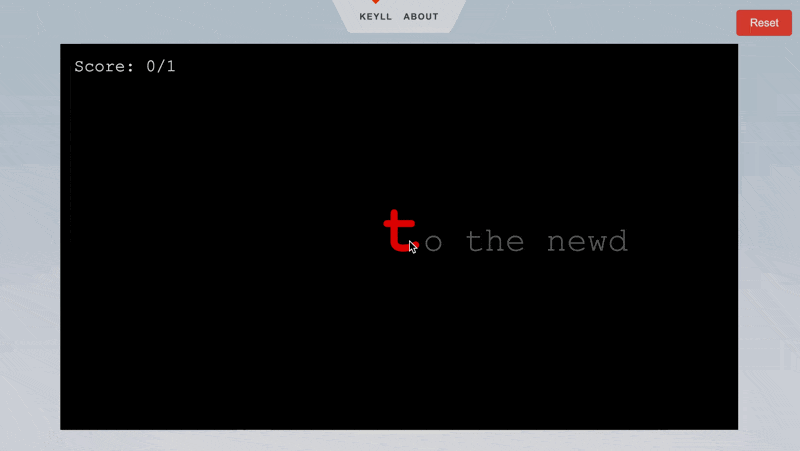

# [WIP] Keyll

Simple touch typing trainer written in [p5](https://p5js.org/).

  

## Dev

Other than the p5 library, no other dependencies are required.

Tips:

- On VSCode, install the `Live Server` extension and open the `index.html` file with it (`[ctrl|cmd]+shift+p` -> `Open with Live Server`).

## TODO

- [x] Add reload/reset.
- [x] Add some UI element for hit/missed chars.
- [x] Improve basic UI, center window, etc.
- [x] Implement basic score system.
- [ ] Add settings in UI and inject in game constructor.
- [ ] Better structure code and bundle it.
- [ ] Deploy on GitHub Pages.
- [ ] Implement timer.
- [ ] Implement stats system.
